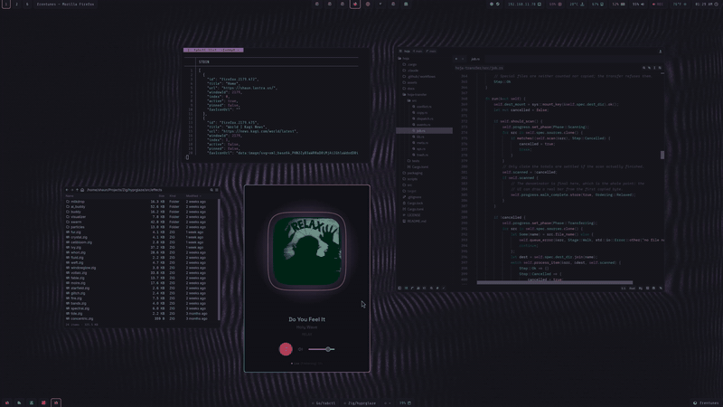

# dots

Desktop configuration for `desk`.
Arch Linux, Hyprland, Wayland, Rosé Pine.



The GIF is a 3 second loop. For the full clip, see
[docs/demo.mp4](docs/demo.mp4). It is 1080p and 8 seconds.

## Session

greetd starts tuigreet. tuigreet starts Hyprland.
`hyprland.lua` then starts four programs.

| Program | Function |
|---|---|
| `waybar` | Two bars. Status on the top. Tabs and Claude chips on the bottom. |
| `hyprglaze` | Shader wallpaper daemon. It draws the wallpaper. |
| `mako` | Notifications. |
| `idle.sh` | Idle timers. It calls `scripts/tv-screen.sh`. |
| `wl-paste` | Clipboard watcher. It stores history in `cliphist`. |

Hyprland reads the Lua files. Hyprland reloads the configuration when you save a
file. Do not run `hyprctl reload`.

## Layout

```
config/
├── hypr/      hyprland.lua, binds.lua, theme.lua, hyprglaze.toml, idle.sh, scripts/
├── waybar/    config, style.css, colors.css, scripts/
├── rofi/      scripts/, themes/
├── kitty/     kitty.conf, colors.conf
├── mako/      config, scripts/lamp.sh
├── nvim/lua/  colors.lua
└── starship.toml
```

## rofi

Each script uses the theme with the same name.
`themes/colors.rasi` and `themes/style.rasi` are shared.

| Key | Script | Function |
|---|---|---|
| `SUPER+Space` | | Application launcher. It uses `themes/launcher.rasi`. |
| `SUPER+W` | `tabs.sh` | Browser tab switcher. |
| `SUPER+A` | `audio.sh` | PipeWire sink switcher. |
| `SUPER+B` | `effect.sh` | hyprglaze shader effect. |
| `SUPER+V` | `clipboard.sh` | Clipboard history. |
| `SUPER+N` | `notifications.sh` | mako history. |
| `Print` | `capture.sh` | Screenshot or screen record. |

## Other keys

`binds.lua` holds all keybinds. These are the ones that call other programs.

| Key | Function |
|---|---|
| `SUPER+Return` | Terminal. `kitty`. |
| `SUPER+E` | File manager. `hoja`. |
| `SUPER+C` | Colour picker. `hyprpicker`. |
| `SUPER+O` | Office light. It calls `kasactl.py`. |
| `SUPER+P` | Phone mirror. It starts or stops `scrcpy`. |
| `SUPER+D` | Show or hide the scratchpad. |
| `SUPER+SHIFT+D` | Move the window to the scratchpad. |

This box has no backlight device. There are no brightness keys.
There is no reload key, because Hyprland reloads the Lua when you save a file.

## Colors

The palette is Rosé Pine. Edit these files by hand.

| File | Read by |
|---|---|
| `hypr/theme.lua` | `hyprland.lua` |
| `kitty/colors.conf` | `kitty.conf` |
| `waybar/colors.css` | `style.css` |
| `rofi/themes/colors.rasi` | all other `.rasi` files |
| `nvim/lua/colors.lua` | `nvim/init.lua` |

`mako/config` and `starship.toml` contain their own colors.

## Requirements

These files are not in this repository. The desktop needs them.

| Path | Function |
|---|---|
| `~/.local/bin/tabstrip` | Bottom tab strip. See [slastra/tabstrip](https://github.com/slastra/tabstrip). It needs `tabctl`. |
| `~/.local/bin/waybar` | Patched waybar. A package update does not replace it. |
| `~/Projects/Python/kasactl/kasactl.py` | `SUPER+O` office light. |
| `~/.claude/bin/claude-speak` | Voice for the Claude chips. |
| `~/.config/hypr/hyprglaze-aws.env` | AWS keys for hyprglaze. Write this file by hand. |

Packages: `hyprland hyprglaze-git hyprpicker waybar mako rofi kitty hoja-git
swayidle wttrbar satty grim slurp gpu-screen-recorder playerctl wireplumber
cliphist wl-clipboard scrcpy jq tabctl rose-pine-icons`

## Warnings

- Do not run `nwg-look -a`. It replaces `~/.config/gtk-4.0/gtk.css` with a symlink.
- GTK4 applications read the CSS one time at start. Restart the application after
  you change the CSS.
- The fish and GTK configurations are not in this repository.
- The device addresses in `binds.lua` and `scripts/tv-screen.sh` are on a private
  LAN. Change them for your own network.

## License

GPL-3.0. See [LICENSE](LICENSE).

The rofi themes in `config/rofi/themes/` derive from
[adi1090x/rofi](https://github.com/adi1090x/rofi) by Aditya Shakya, which is
GPL-3.0. The original author headers are kept in each file.
